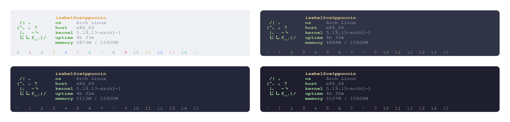
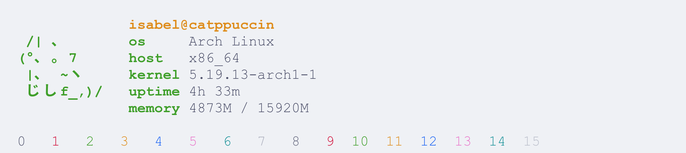
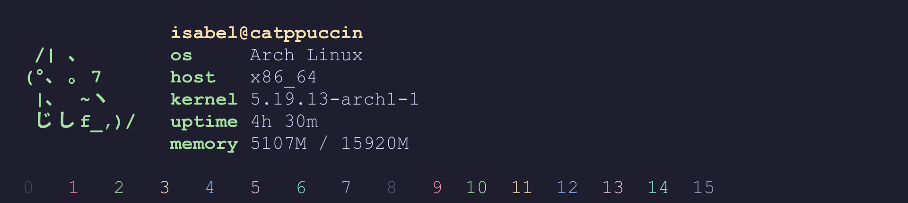

<h3 align="center">
	 
	
	Catppuccin for <a href="https://wiki.archlinux.org/title/x_resources">Xresources</a>
	
</h3>

    
    
    

  

## Previews

🌻 Latte

🪴 Frappé

🌺 Macchiato

🌿 Mocha

## Usage

🌻 Latte

<pre><code>curl -o xresources https://raw.githubusercontent.com/catppuccin/xresources/main/latte.Xresources</code></pre>

🪴 Frappé

<pre><code>curl -o xresources https://raw.githubusercontent.com/catppuccin/xresources/main/frappe.Xresources</code></pre>

🌺 Macchiato

<pre><code>curl -o xresources https://raw.githubusercontent.com/catppuccin/xresources/main/macchiato.Xresources</code></pre>

🌿 Mocha

<pre><code>curl -o xresources https://raw.githubusercontent.com/catppuccin/xresources/main/mocha.Xresources</code></pre>

Load it by : `xrdb -merge <path to xresources file>`

## 💝 Thanks to

-   [Vapourium](https://github.com/Vapourium)
-   [Sanjay Pavan](https://github.com/WitherCubes)
-   [siduck](https://github.com/siduck)

&nbsp;

Copyright &copy; 2021-present <a href="https://github.com/catppuccin" target="_blank">Catppuccin Org</a>

